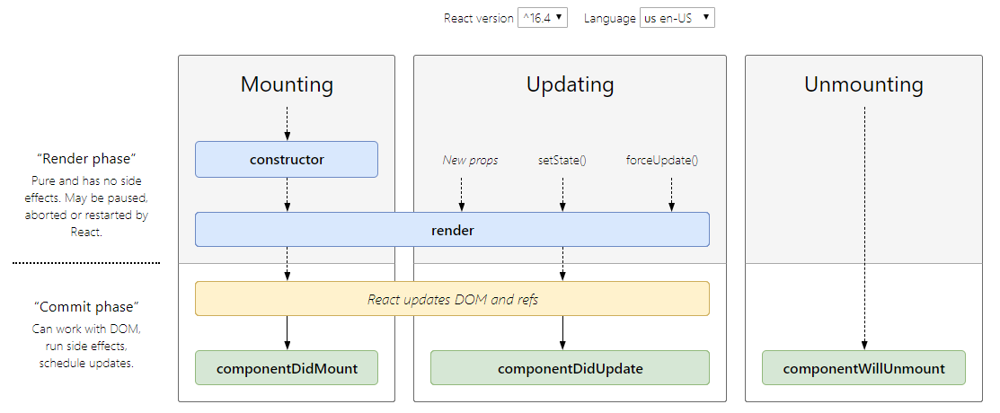

# Component Lifecycle

ในแต่ละ Class Components จะมี lifecycles ที่ใช้หลักๆ ตามรูปด้านล่าง



ตัวที่น่าสนใจ คือ

- **componentDidMount:** จะเรียกหลัง render แค่ครั้งแรกครั้งเดียวเท่านั้น

  - เรียก APIs กำหนดค่าเริ่มต้นให้กับ state
  - subscript การทำงานบางอย่าง

- **componentDidUpdate:** ซึ่งทุกครั้งที่ค่า state หรือ props มีการเปลี่ยนแปลง จะมีการ render ใหม่ แล้วจะเรียกมาที่ `componentDidUpdate`

  - เรียก APIs ตามข้อมูลของ state หรือ props ที่เปลี่ยนไป เช่น แสดงรายละเอียดสินค้าตาม productId ที่ถูกเลือก

- **componentWillUnmount:** จะถูกเรียกก่อนที่ components นั้นจะถูก unmount ออกไป
  - ใช้เคลียร์ค่า หรือ unsubscript

## ตัวอย่าง

Components แสดงเวลา โดยเวลาจะเปลี่ยนการแสดงผลทุกๆ 1 วินาที โดยจะใช้ setInterval เป็นตัวอัพเดทค่าใน state ซึ่งถ้า component ถูก unmount ไปแล้วตัว setInterval ก็ยังทำงานอยู่ ถ้าเปิดมาใหม่ก็จะมี setInterval ตัวใหม่ทำงานเพิ่มขึ้นมาอีก ดังนั้นก่อนจะ unmount ไปต้องยกเลิกการทำงานของ setInterval โดยใช้ `componentWillUnmount`

```jsx
class Clock extends React.Component {
  state = { date: new Date() };

  componentDidMount() {
    this.timerID = setInterval(() => this.tick(), 1000);
  }

  componentWillUnmount() {
    clearInterval(this.timerID);
  }

  tick() {
    this.setState({
      date: new Date()
    });
  }

  render() {
    return (
      <div>
        <h2>Time is {this.state.date.toLocaleTimeString()}.</h2>
      </div>
    );
  }
}

ReactDOM.render(<Clock />, document.getElementById('root'));
```

**เรื่องถัดไป** [HTTP Requests](https://github.com/somprasongd/todo-react-app/tree/5-http-requests)

**เรื่องก่อนหน้า** [Components and Props](https://github.com/somprasongd/todo-react-app/tree/3-components)

**[หน้าแรก](https://github.com/somprasongd/todo-react-app)**
